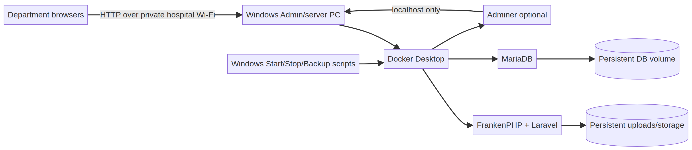
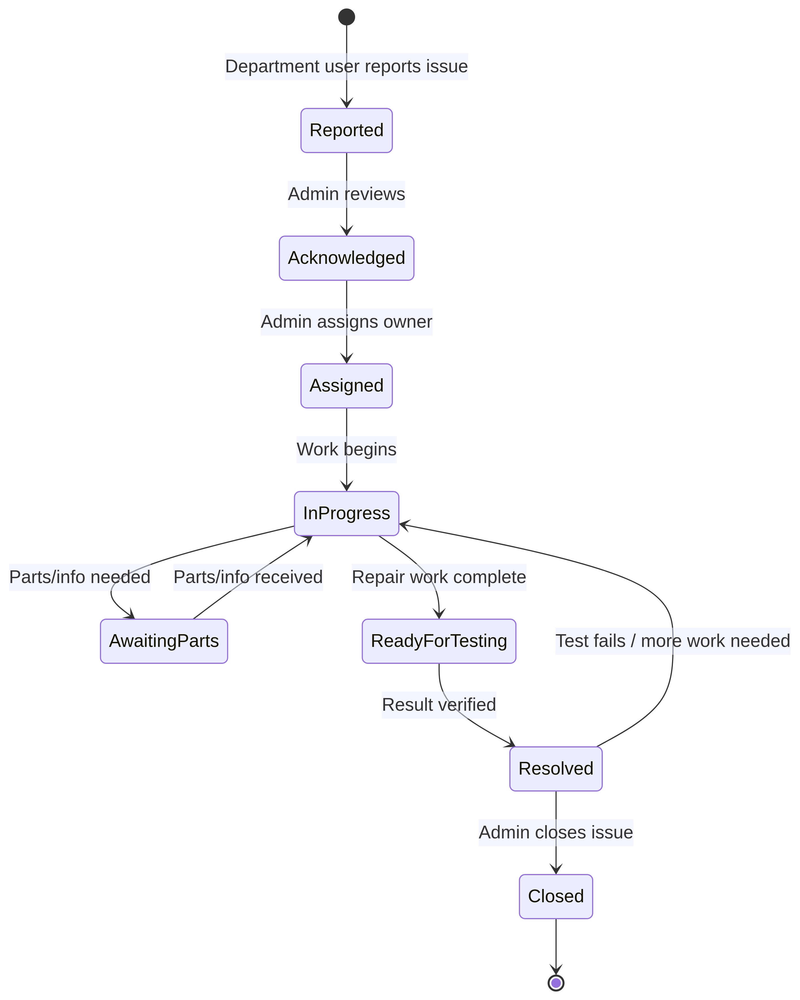

# MedTrack Hospital Equipment Manager
## Proof of Concept Summary

**Purpose:** One shared, accountable source of truth for hospital equipment.  
**Deployment:** Central Windows PC on the hospital private Wi-Fi/LAN.  
**Users:** Administrators and department users.  
**Core stack:** Laravel + FrankenPHP + MariaDB + Docker Compose.  
**Technical database client:** Adminer, localhost-only.

## Product concept

MedTrack lets authorized hospital staff identify equipment, see where it belongs, understand its current operational state, report issues, assign responsibility, track repair progress, and preserve a history of what happened.

The application is installed once on the central server PC. Department computers do not install the application or database; they use a browser to connect to the central LAN address.

## Architecture

FrankenPHP serves Laravel. MariaDB stores the one shared database in persistent storage. Adminer is an optional technical client for direct database work and is not part of normal hospital operations. Windows scripts start, stop, back up, and inspect the stack.

## Core domain

| Entity | Purpose |
|---|---|
| Equipment | Identity, asset number, serial number, department, location, status, photo, lifecycle |
| Department | Organizational owner and contact details |
| User | Administrator or department user |
| Issue report | Problem description, reporter, priority, state, resolution |
| Assignment | Responsible user, assignment time, due date, completion |
| Activity history | Who changed what and when |
| Attachment | Equipment photos and issue files |

## Issue and repair workflow

The issue lifecycle is **Reported → Acknowledged → Assigned → In Progress → Awaiting Parts → Ready for Testing → Resolved → Closed**. Equipment status is updated explicitly; resolving an issue does not silently mark equipment as safe to use.

## MVP boundary

The first core includes authentication, role-based access, departments, equipment registration, asset and serial number support, search, equipment detail, issue reporting, assignment, repair progress, comments, resolution, audit history, optional photos, archive, controlled permanent delete, exports, health checks, backups, and LAN operation.

Maintenance schedules, calibration, vendors, warranties, procurement, automated notifications, analytics, mobile clients, cloud sync, patient data, and public internet access are deferred extensions.

## Operations

The central Windows PC runs Docker Desktop and the Docker Compose stack. `START_MEDTRACK.bat` starts Docker and the containers. `STOP_MEDTRACK.bat` stops containers without deleting volumes. `OPEN_ADMINER.bat` starts Adminer on the central PC only. `BACKUP_MEDTRACK.bat` creates a MariaDB SQL backup.

Department users open the server’s stable private address, such as `http://192.168.1.50:8080`. No public port forwarding is needed. The Windows firewall should permit the application port only on the private hospital network.

## Success test

The PoC succeeds when two or more department browsers can use the same central app, see the same equipment data, report and assign an issue, move it through repair progress, close it with history preserved, restart the server without data loss, create and restore a backup, and operate the stack using the Windows scripts.

> **Stable aim:** Every authorized staff member can find the correct equipment, understand where it belongs and what state it is in, report a problem, see who is responsible for it, track progress, and verify what happened later.

## References

- [Laravel](https://laravel.com/docs)
- [FrankenPHP Laravel](https://frankenphp.dev/docs/laravel/)
- [Docker Compose](https://docs.docker.com/compose/)
- [Adminer](https://www.adminer.org/)
